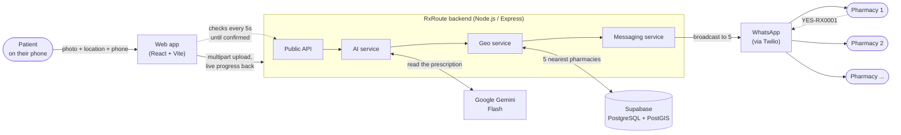
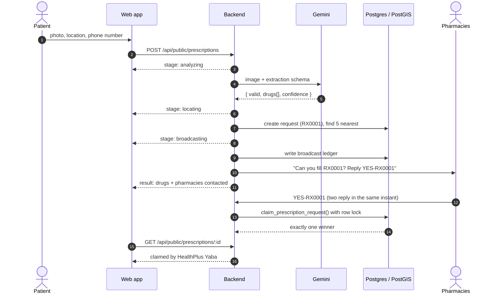

# RxRoute

**Take a photo of your prescription. The nearest pharmacy that has it gets back to you.**


---

## Why I built this

Here's what usually happens in Nigeria when a doctor hands you a prescription. You go to the closest pharmacy and they don't have it. You try the next one, then the next. Sometimes you're doing this while you feel awful, or while someone you love is waiting at home.

There are plenty of pharmacies nearby. What's missing is a quick way to ask all of them at once.

RxRoute does that asking for you. You open the site on your phone, take a photo of the prescription and share your location. The system reads the handwriting, finds the five closest pharmacies, and messages all of them at the same time. The first pharmacy to confirm gets the order, and your screen updates with their name, address and a button for directions.

There's no app to install and no account to create.

---

## How it works



In plain words:

1. **The patient fills in one short form.** On a phone, tapping the upload area opens the camera. The browser shares their location, and they add a phone number so the pharmacy can reach them.
2. **Gemini reads the prescription.** It checks whether the image really is a prescription and pulls out each drug and dose as structured JSON. Blurry photos and selfies are turned away with a clear reason.
3. **PostGIS finds the closest pharmacies.** It searches within 5 km first. If nothing turns up, it widens the radius to 10 km, then 20 km.
4. **All five pharmacies are messaged at once.** Each gets the drug list and a short code like `RX0001`.
5. **First reply wins.** The pharmacy that replies `YES-RX0001` first gets the order, and the patient's screen switches to "HealthPlus Yaba has your medication" with directions and a call button.

### Request lifecycle



---

## The parts I'm proudest of

Most of the work went into the edge cases that turn up once real people start using it.

### Two pharmacies reply at the same moment. Only one can win.
If the check happened in Node (read the status, then update it), two replies arriving together could both be accepted. So the claim is decided inside Postgres with a `SELECT … FOR UPDATE` row lock. The second transaction waits, sees the request is already claimed, and is told who got it. I tested this with 5 connections claiming the same order at once: **1 winner, 4 politely turned away**.

### The progress bar tells the truth
A lot of loading screens step through messages on a timer. This one doesn't. The upload endpoint streams newline-delimited JSON, and each step on screen (analyzing, locating, broadcasting) lights up only when the backend actually reaches it. If Gemini is slow, you see that it's still on step two.

### No pretending the message went out
If WhatsApp delivery fails for some or all pharmacies, the page says so ("sent to 3 of 5", or "we couldn't reach the pharmacies") instead of showing a cheerful "request sent". Every send is recorded with its Twilio SID or error, and one failed send never stops the other four.

### Built for phones on slow networks
Phone cameras produce 4 to 12 MB photos. The browser shrinks them to 2000px JPEGs before uploading, which keeps handwriting readable and cuts the upload to a few hundred KB. The layout is a single column designed for a phone, and it also works fine on a laptop.

### Reference codes a person can type on a phone keypad
A UUID is useless when a pharmacist has to type it back on a phone. The codes come from a database sequence encoded in Crockford base32, which leaves out letters that look like digits (`I`, `L`, `O`, `U`). You get `RX0001`, `RX0002` and so on. They're unique because of the sequence, not by chance (no collisions across 2,000+ rows).

### Write the ledger before sending the first message
A fast pharmacy can reply while the other four are still being messaged. Because the record of who was contacted is saved *before* the first message goes out, that quick reply can still be checked and accepted.

### The public API shares as little as it can
The patient-facing endpoints never return other patients' phone numbers or raw AI output. A pharmacy's phone number only appears once that pharmacy has accepted the request. Status lookups need the request's UUID rather than the guessable `RX0001` code, and uploads are rate limited per device because each one costs an AI call.

---

## Tech stack

| Layer | Choice | Why |
|---|---|---|
| Frontend | **React 19, Vite, Tailwind CSS 4** | Fast to load, simple to deploy as static files, and easy to keep visually consistent |
| Backend | **Node.js, Express** | Small, fast and well suited to I/O-heavy work like uploads and messaging |
| Database | **Supabase (PostgreSQL + PostGIS)** | Real geospatial queries with a GIST index instead of distance maths in JavaScript |
| AI | **Google Gemini Flash** | Strong at reading handwriting, cheap, and supports structured JSON output |
| Messaging | **WhatsApp via Twilio** | Reaches pharmacies on the app they already use every day |
| Validation | **Zod** | The server won't start with bad config, and requests are checked at the edge |

---

## Project structure

```
RxRoute/
├── frontend/                     # The patient web app
│   └── src/
│       ├── App.jsx               # Form → processing → result
│       ├── components/           # Photo picker, location, phone, progress, results
│       └── lib/                  # API client (streams progress), image shrinking
└── backend/                      # The API, AI pipeline and messaging
    ├── server.js                 # Boot: verify DB + Twilio, start server, schedule expiry sweep
    ├── app.js                    # Express app, logging, error handling
    ├── config/                   # Validated env, Supabase + Twilio clients
    ├── routes/                   # Public, webhook, pharmacy and prescription routes
    ├── controllers/
    │   ├── publicController.js   # Upload endpoint the web app calls
    │   └── whatsappController.js # WhatsApp conversation handling
    ├── services/
    │   ├── prescriptionService.js# The core pipeline: ingest → verify → match → broadcast → claim
    │   ├── aiService.js          # Gemini vision wrapper with a strict response schema
    │   ├── geoService.js         # PostGIS helpers
    │   ├── mediaService.js       # Image type and size checks
    │   └── messagingService.js   # Outbound WhatsApp + message templates
    ├── middleware/               # API key auth, rate limiting, CORS, Twilio signature check
    └── db/
        ├── schema.sql            # Tables, PostGIS functions, row-level security
        └── seed.sql              # 10 real Lagos pharmacy locations (safe test numbers)
```

---

## Running it locally

You'll need Node.js 20.19 or newer, a Supabase project, a Gemini API key and a Twilio account.

**1. Backend** (runs on port 3000)

```bash
cd backend
npm install
cp .env.example .env          # add your Supabase, Twilio and Gemini keys

npm run db:push               # create tables and functions
npm run db:seed               # load 10 Lagos pharmacies
npm run db:verify             # confirm the backend can reach a real database

npm run dev
```

**2. Frontend** (in a second terminal, runs on port 5173)

```bash
cd frontend
npm install
npm run dev
```

Open http://localhost:5173. The dev server forwards `/api` to the backend, so there's nothing else to configure.

> Browsers only share location on `https` pages or `localhost`. To try it on your phone, expose the frontend with a tunnel such as `ngrok http 5173`.

**3. Pharmacy replies** come in over WhatsApp, so Twilio needs to reach your backend:

```bash
ngrok http 3000
# Twilio Console → Messaging → WhatsApp Sandbox
# "When a message comes in" → https://<your-id>.ngrok-free.app/webhook/whatsapp (POST)
```

Then set `PUBLIC_BASE_URL` to that URL and `VALIDATE_TWILIO_SIGNATURE=true`. To play the pharmacy yourself, change one seeded pharmacy's number to your own WhatsApp number.

---

## API

### Public (used by the web app)

| Method | Endpoint | What it does |
|---|---|---|
| `POST` | `/api/public/prescriptions` | Multipart upload (`photo`, `phone`, `latitude`, `longitude`). Streams progress, then the result |
| `GET` | `/api/public/prescriptions/:id` | Current status, and the pharmacy once one accepts |

### Admin

Every other `/api/*` route needs an `x-api-key` header, and this is enforced in production because the responses include patient phone numbers.

| Method | Endpoint | What it does |
|---|---|---|
| `GET` | `/api/pharmacies/nearby?lat=&lng=&radius=` | Live PostGIS search |
| `GET / POST / PATCH / DELETE` | `/api/pharmacies[/:id]` | Manage pharmacies (soft delete by default) |
| `POST` | `/api/pharmacies/bulk` | Import many at once |
| `GET` | `/api/prescriptions[/:idOrCode]` | Look up by UUID or short code |
| `POST` | `/api/prescriptions/:code/claim` | Claim (returns `409` if already taken) |
| `POST` | `/api/prescriptions/:code/rebroadcast` | Resend without calling the AI again |
| `GET` | `/api/prescriptions/:code/broadcasts` | Delivery status for each pharmacy |
| `GET` | `/api/stats`, `/api/activity` | Dashboard data |
| `GET` | `/health`, `/health/deep` | `/deep` checks Supabase, PostGIS, Twilio and Gemini |

<details>
<summary><b>Example requests</b></summary>

```bash
# Send a prescription the same way the web app does
curl -N localhost:3000/api/public/prescriptions \
  -F photo=@prescription.jpg -F phone=08031234567 \
  -F latitude=6.5095 -F longitude=3.3711

# Pharmacies near Yaba
curl -H 'x-api-key: your-key' "localhost:3000/api/pharmacies/nearby?lat=6.5095&lng=3.3711&radius=5000"

# Claim a request as a pharmacy
curl -X POST -H 'x-api-key: your-key' -H 'content-type: application/json' \
  localhost:3000/api/prescriptions/RX0001/claim \
  -d '{"pharmacy_phone":"+2348000000001"}'
```
</details>

---

## How I tested it

I ran the schema and API against a real PostgreSQL 16 + PostGIS 3.4 database and a real PostgREST instance, not mocks.

- The schema applies cleanly and can be re-run safely
- Geo queries use the GIST index (`Index Scan using pharmacies_geo_index`), not a full table scan
- 5 simultaneous claims on one order → exactly 1 winner
- 44 HTTP route checks covering auth, validation, success and error paths
- PDFs, videos, oversized files and empty uploads are all rejected with clear messages
- The web flow was driven end to end in headless Chrome at phone size: photo upload, location, real Gemini extraction, PostGIS match and broadcast

`npm run db:verify` repeats the database checks against your own Supabase project. Once your keys are set, `GET /health/deep` confirms every dependency is reachable.

---

## Configuration

Backend settings live in `backend/.env`. Required: `SUPABASE_URL`, `SUPABASE_SERVICE_ROLE_KEY`, `TWILIO_ACCOUNT_SID`, `TWILIO_AUTH_TOKEN`, `TWILIO_WHATSAPP_NUMBER`, `GEMINI_API_KEY`. See [`backend/.env.example`](backend/.env.example) for everything else.

| Variable | Default | What it controls |
|---|---|---|
| `GEMINI_MODEL` | `gemini-3.8-flash` | Which Gemini model reads the prescription |
| `SEARCH_RADIUS_METERS` | `5000` | Starting search radius (widens to 2× then 4×) |
| `MAX_PHARMACIES_PER_BROADCAST` | `5` | How many pharmacies get each request |
| `CLAIM_REQUIRES_BROADCAST` | `true` | Only pharmacies that were asked can claim |
| `PUBLIC_UPLOADS_PER_HOUR` | `20` | Upload limit per device |
| `CORS_ORIGINS` | none | The frontend's URL, when it's hosted on a different domain from the API |
| `API_KEY` | none | Protects the admin API; required in production |

The frontend has one optional setting, `VITE_API_BASE_URL`, for when the frontend and backend are deployed on different domains.

> `SUPABASE_SERVICE_ROLE_KEY` bypasses row-level security. Keep it on the server only.

---

## What's next

- Move pharmacy messaging from WhatsApp to Telegram, which has a free bot API
- A web dashboard for pharmacies to manage stock and see past orders
- Bring on pharmacies in all 36 states and the FCT, so coverage reaches every part of Nigeria
- Let the patient widen the search with one tap when no pharmacy accepts in time

---

<p align="center">
  Built to make "Do you have this drug?" a one-photo question.<br/>
  If you have feedback or ideas, open an issue. I'd love to hear them.
</p>
