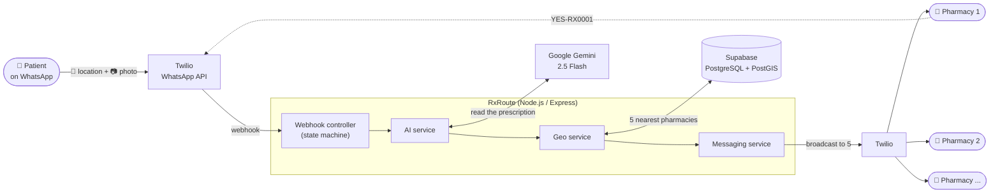
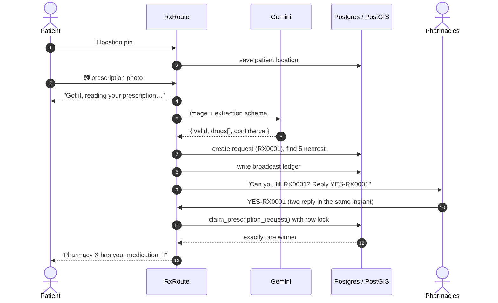

# RxRoute 💊

**Send a photo of your prescription on WhatsApp. The nearest pharmacy that has it gets back to you.**


---

## Why I built this

Here's what usually happens in Lagos when a doctor hands you a prescription. You go to the closest pharmacy and they don't have it. You try the next one, then the next. Sometimes you're doing this while you feel awful, or while someone you love is waiting at home.

Pharmacies are close by, and most of them are on WhatsApp. What's missing is a quick way to ask all of them at once.

RxRoute does that asking for you. You send a photo of the prescription and your location. The system reads the handwriting, finds the five closest pharmacies, and messages all of them at the same time. The first pharmacy to reply `YES` gets the order, and you get their name and address.

There's no app to download and no account to create. If you can use WhatsApp, you can use this.

---

## How it works



In plain words:

1. **The patient sends a location pin and a photo.** The order doesn't matter. If the photo comes first, it's held until the pin arrives.
2. **Gemini reads the prescription.** It checks whether the image really is a prescription and pulls out each drug and dose as structured JSON. Blurry photos and selfies get a polite rejection.
3. **PostGIS finds the closest pharmacies.** It searches within 5 km first. If nothing turns up, it widens the radius to 10 km, then 20 km.
4. **All five pharmacies are messaged at once.** Each gets the drug list and a short code like `RX0001`.
5. **First reply wins.** The pharmacy that replies `YES-RX0001` first gets the order, and the patient is told where to go.

### Request lifecycle



---

## The parts I'm proudest of

Most of the work went into the edge cases that turn up once real people start using it.

### 🏁 Two pharmacies reply at the same moment. Only one can win.
If the check happened in Node (read the status, then update it), two replies arriving together could both be accepted. So the claim is decided inside Postgres with a `SELECT … FOR UPDATE` row lock. The second transaction waits, sees the request is already claimed, and is told who got it. I tested this with 5 connections claiming the same order at once: **1 winner, 4 politely turned away**.

### 🔢 Reference codes a person can type on a phone keypad
A UUID is useless when a pharmacist has to type it back on a phone. The codes come from a database sequence encoded in Crockford base32, which leaves out letters that look like digits (`I`, `L`, `O`, `U`). You get `RX0001`, `RX0002` and so on. They're unique because of the sequence, not by chance (no collisions across 2,000+ rows).

### ⏱️ Twilio waits 15 seconds. The AI takes longer.
A media download, a Gemini call and five outgoing messages often take more than Twilio's webhook timeout. The webhook replies to Twilio straight away, keeps working in the background, and sends results through the REST API.

### 🔁 Twilio retries, and nothing runs twice
Every incoming `MessageSid` is saved before any processing starts. If Twilio sends the same message again, it's recognised and skipped, so the AI doesn't read the photo twice and pharmacies don't get duplicate broadcasts.

### 📒 Write the ledger before sending the first message
A fast pharmacy can reply while the other four are still being messaged. Because the record of who was contacted is saved *before* the first message goes out, that quick reply can still be checked and accepted.

### 🧾 Failures are kept and explained
An unreadable photo is stored as `failed` along with the AI's reason, so you can see why it was rejected. One failed send never stops the other four, and every outcome is logged with its Twilio SID or error.

### ☎️ The system won't guess at phone numbers
`0803 111 2233` has no country code. Guessing one could create a pharmacy that Twilio can never reach, so the API returns a clear `400` and asks for international format.

---

## Tech stack

| Layer | Choice | Why |
|---|---|---|
| Runtime | **Node.js 18+, Express** | Small, fast and well suited to webhook-heavy I/O |
| Database | **Supabase (PostgreSQL + PostGIS)** | Real geospatial queries with a GIST index instead of distance maths in JavaScript |
| AI | **Google Gemini 2.5 Flash** | Strong at reading handwriting, cheap, and supports structured JSON output |
| Messaging | **Twilio WhatsApp API** | Reaches people on the app they already use every day |
| Validation | **Zod** | The server won't start with bad config, and requests are checked at the edge |

---

## Project structure

```
RxRoute/
├── server.js                 # Boot: verify DB + Twilio, start server, schedule expiry sweep
├── app.js                    # Express app, logging, error handling
├── config/                   # Validated env, Supabase + Twilio clients
├── routes/                   # Webhook, pharmacy, and prescription routes
├── controllers/
│   └── whatsappController.js # The WhatsApp conversation state machine
├── services/
│   ├── prescriptionService.js# The core pipeline: ingest → verify → match → broadcast → claim
│   ├── aiService.js          # Gemini vision wrapper with a strict response schema
│   ├── geoService.js         # PostGIS helpers
│   ├── mediaService.js       # Safe media downloads (type + size guards)
│   ├── messagingService.js   # Outbound WhatsApp + message templates
│   └── sessionService.js     # Location pins and parked photos
├── middleware/               # API key auth, Twilio signature check, errors
└── db/
    ├── schema.sql            # Tables, PostGIS functions, row-level security
    └── seed.sql              # 10 real Lagos pharmacy locations (safe test numbers)
```

---

## Running it locally

```bash
npm install
cp .env.example .env          # add your Supabase, Twilio and Gemini keys

npm run db:push               # create tables and functions
npm run db:seed               # load 10 Lagos pharmacies
npm run db:verify             # confirm the backend can reach a real database

npm run dev
```

To connect WhatsApp, expose your local server and point the Twilio Sandbox at it:

```bash
ngrok http 3000
# Twilio Console → Messaging → WhatsApp Sandbox
# "When a message comes in" → https://<your-id>.ngrok-free.app/webhook/whatsapp (POST)
```

Then set `PUBLIC_BASE_URL` to your ngrok URL and `VALIDATE_TWILIO_SIGNATURE=true`.

> 💡 To see the pharmacy side yourself, change one seeded pharmacy's number to your own WhatsApp number.

### Talking to it on WhatsApp

| Who | Sends | What happens |
|---|---|---|
| Patient | 📍 location pin + 📷 photo | The prescription is read and broadcast to nearby pharmacies |
| Pharmacy | `YES-RX0001` | Claims the order |
| Anyone | `STATUS RX0001` | Shows where a request is up to |
| Anyone | `HELP` | Explains how to use it |

---

## REST API

There's also a REST API, built for an admin dashboard. Every `/api/*` route needs an `x-api-key` header, and this is enforced in production because the responses include patient phone numbers.

| Method | Endpoint | What it does |
|---|---|---|
| `GET` | `/api/pharmacies/nearby?lat=&lng=&radius=` | Live PostGIS search |
| `GET / POST / PATCH / DELETE` | `/api/pharmacies[/:id]` | Manage pharmacies (soft delete by default) |
| `POST` | `/api/pharmacies/bulk` | Import many at once |
| `GET` | `/api/prescriptions[/:idOrCode]` | Look up by UUID or short code |
| `POST` | `/api/prescriptions` | Run the full pipeline, using the same code path as WhatsApp |
| `POST` | `/api/prescriptions/:code/claim` | Claim (returns `409` if already taken) |
| `POST` | `/api/prescriptions/:code/rebroadcast` | Resend without calling the AI again |
| `GET` | `/api/prescriptions/:code/broadcasts` | Delivery status for each pharmacy |
| `GET` | `/api/stats`, `/api/activity` | Dashboard data |
| `GET` | `/health`, `/health/deep` | `/deep` checks all four dependencies |

<details>
<summary><b>Example requests</b></summary>

```bash
K='-H x-api-key:your-key'

# Pharmacies near Yaba
curl $K "localhost:3000/api/pharmacies/nearby?lat=6.5095&lng=3.3711&radius=5000"

# Send a prescription through the real pipeline
curl -X POST $K -H 'content-type: application/json' localhost:3000/api/prescriptions \
  -d '{"patient_phone":"+2348012345678","media_url":"https://.../rx.jpg",
       "latitude":6.5095,"longitude":3.3711}'

# Claim it
curl -X POST $K -H 'content-type: application/json' \
  localhost:3000/api/prescriptions/RX0001/claim \
  -d '{"pharmacy_phone":"+2348000000001"}'
```
</details>

---

## How I tested it

I ran the schema and API against a real PostgreSQL 16 + PostGIS 3.4 database and a real PostgREST instance, not mocks.

- ✅ The schema applies cleanly and can be re-run safely
- ✅ Geo queries use the GIST index (`Index Scan using pharmacies_geo_index`), not a full table scan
- ✅ 5 simultaneous claims on one order → exactly 1 winner
- ✅ 44 HTTP route checks covering auth, validation, success and error paths
- ✅ PDFs, videos, oversized files and empty uploads are all rejected with clear messages

`npm run db:verify` repeats the database checks against your own Supabase project. Once your keys are set, `GET /health/deep` confirms Supabase, Twilio and Gemini are all reachable.

---

## Configuration

Required: `SUPABASE_URL`, `SUPABASE_SERVICE_ROLE_KEY`, `TWILIO_ACCOUNT_SID`, `TWILIO_AUTH_TOKEN`, `TWILIO_WHATSAPP_NUMBER`, `GEMINI_API_KEY`. See [`.env.example`](.env.example) for everything else.

| Variable | Default | What it controls |
|---|---|---|
| `SEARCH_RADIUS_METERS` | `5000` | Starting search radius (widens to 2× then 4×) |
| `MAX_PHARMACIES_PER_BROADCAST` | `5` | How many pharmacies get each request |
| `CLAIM_REQUIRES_BROADCAST` | `true` | Only pharmacies that were asked can claim |
| `WEBHOOK_ASYNC` | `true` | Reply to Twilio immediately and process in the background |
| `VALIDATE_TWILIO_SIGNATURE` | `false` | Turn on for any deployed environment |
| `API_KEY` | none | Protects `/api/*`; required in production |

> 🔒 `SUPABASE_SERVICE_ROLE_KEY` bypasses row-level security. Keep it on the server only.

---

## What's next

- 💳 Payment and delivery confirmation inside the chat
- 📊 A web dashboard for pharmacies to manage stock and see past orders
- 🌍 More cities beyond Lagos
- 🔔 Remind the patient when a request expires unclaimed, and offer a wider search

---

<p align="center">
  Built to make "Do you have this drug?" a one-message question.<br/>
  If you have feedback or ideas, open an issue. I'd love to hear them.
</p>
